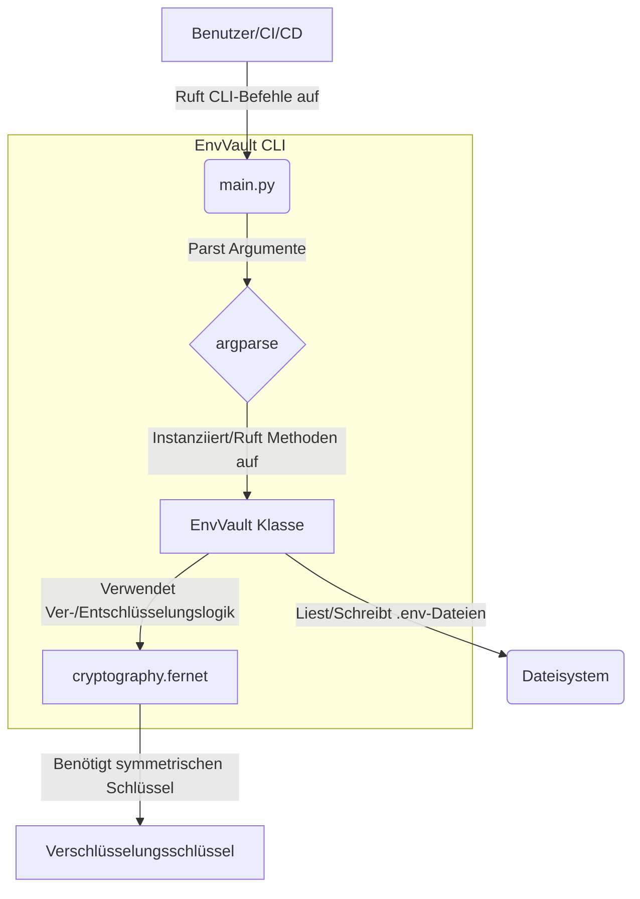

# EnvVault CLI: Architekturübersicht

Dieses Dokument bietet einen detaillierten Einblick in die Architektur des EnvVault CLI-Dienstprogramms und beschreibt dessen Designprinzipien, Technologieauswahl, Sicherheitsmodell und Bereiche für zukünftige Entwicklungen.

## 1. Zweck und Problemstellung

In der modernen Softwareentwicklung verlassen sich Anwendungen häufig auf sensible Konfigurationsdaten wie API-Schlüssel, Datenbankanmeldeinformationen und Zugriffstoken. Das direkte Speichern dieser Geheimnisse in Klartext-`.env`-Dateien oder deren Übertragung in die Versionskontrolle birgt erhebliche Sicherheitsrisiken. EnvVault CLI begegnet diesem Problem, indem es eine einfache, aber robuste Kommandozeilenschnittstelle zum symmetrischen Ver- und Entschlüsseln dieser Umgebungsvariablen bereitstellt, die es Entwicklern und CI/CD-Pipelines ermöglicht, sensible Daten sicherer zu verwalten.

## 2. Lösungsübersicht

EnvVault CLI ist ein Python-basiertes Dienstprogramm, das um eine Kernklasse `EnvVault` herum aufgebaut ist, die die Ver- und Entschlüsselungslogik kapselt. Es interagiert mit dem Dateisystem, um `.env`-ähnliche Dateien zu lesen und zu schreiben, und verwendet `argparse` für seine Kommandozeilenschnittstelle.

### High-Level-Architektur:



## 3. Technologiestack

*   **Python**: Die Kernsprache für das CLI-Dienstprogramm, gewählt aufgrund ihrer Lesbarkeit, des umfangreichen Bibliotheks-Ökosystems und der plattformübergreifenden Kompatibilität.
*   **`argparse`**: Pythons Standardbibliothek zum Parsen von Kommandozeilenargumenten, die eine flexible und benutzerfreundliche CLI-Erfahrung bietet.
*   **`cryptography`-Bibliothek**: Eine leistungsstarke und gut geprüfte kryptografische Bibliothek für Python. EnvVault verwendet speziell deren `Fernet`-Implementierung.
    *   **Fernet**: Ein symmetrisches Verschlüsselungsschema, das authentifizierte Verschlüsselung (Vertraulichkeit und Authentizität) bietet. Es verwendet AES im CBC-Modus mit PKCS7-Padding für die Verschlüsselung und HMAC-SHA256 für die Authentifizierung. Es enthält auch einen Zeitstempel, um Replay-Angriffe zu verhindern und stellt sicher, dass der Schlüssel ein URL-sicherer Base64-kodierter String ist.

## 4. Schlüsselverwaltungsstrategie

Die Sicherheit von EnvVault hängt vollständig von der Geheimhaltung und der ordnungsgemäßen Verwaltung des Fernet-Verschlüsselungsschlüssels ab.

*   **Symmetrischer Schlüssel**: Ein einziger symmetrischer Schlüssel wird sowohl für die Ver- als auch für die Entschlüsselung verwendet. Dieser Schlüssel ist ein 32-Byte (256-Bit) URL-sicherer Base64-kodierter String.
*   **Schlüsselgenerierung**: Der Befehl `env-vault-cli generate-key` bietet eine bequeme Möglichkeit, einen neuen, kryptografisch starken Fernet-Schlüssel mit `Fernet.generate_key()` zu generieren.
*   **Schlüsselbereitstellung**: Der Schlüssel **darf nicht** fest im Code hinterlegt oder in die Versionskontrolle übertragen werden. Benutzer sind dafür verantwortlich, den Schlüssel sicher zu speichern und dem CLI-Dienstprogramm zur Verfügung zu stellen. Die primären unterstützten Methoden sind:
    *   **Umgebungsvariable**: Setzen der Umgebungsvariablen `ENVVAULT_KEY` (empfohlen für CI/CD und lokale Entwicklung).
    *   **Kommandozeilenargument**: Direkte Übergabe des Schlüssels über die CLI-Option `-k` oder `--key` (weniger sicher für die interaktive Nutzung aufgrund der Befehlshistorie).
*   **Keine Schlüsselableitung (aktuelle Version)**: Zur Vereinfachung und um den anfänglichen Umfang fokussiert zu halten, implementiert EnvVault CLI derzeit keine passwortbasierte Schlüsselableitung (z.B. PBKDF2HMAC). Der bereitgestellte Schlüssel wird direkt als Fernet-Schlüssel verwendet. Dies bedeutet, dass der Schlüssel selbst ein Fernet-kompatibler Schlüssel sein muss.

## 5. Dateiformate

EnvVault CLI verarbeitet Dateien, die einem einfachen `KEY=VALUE`-Format entsprechen, typisch für `.env`-Dateien.

*   **Klartext-Eingabe (`.env`)**: Standard `.env`-Format. Zeilen, die mit `#` beginnen, werden als Kommentare behandelt und beim Parsen ignoriert. Leere Zeilen werden ebenfalls ignoriert.
    ```env
    VAR1=value1
    # Dies ist ein Kommentar
    VAR2=value2
    ```
*   **Verschlüsselte Ausgabe (`.env.enc`)**: Das Ausgabeformat ist ebenfalls `KEY=ENCRYPTED_VALUE`. Jeder `VALUE` wird durch seine Fernet-verschlüsselte, URL-sichere Base64-kodierte String-Repräsentation ersetzt.
    ```env
    VAR1=gAAAAABl... (langer verschlüsselter String)
    VAR2=gAAAAABl... (langer verschlüsselter String)
    ```

## 6. Sicherheitsüberlegungen

*   **Schlüsselkompromittierung**: Wenn der Fernet-Schlüssel kompromittiert wird, können alle mit diesem Schlüssel verschlüsselten Daten entschlüsselt werden. Robuste Schlüsselverwaltungspraktiken sind von größter Bedeutung.
*   **Seitenkanalangriffe**: Obwohl die `cryptography`-Bibliothek so konzipiert ist, dass sie vielen Seitenkanalangriffen standhält, hängt die Gesamtsicherheit von der Ausführungsumgebung ab. Vermeiden Sie es, das Tool in nicht vertrauenswürdigen Umgebungen auszuführen, in denen Geheimnisse geleakt werden könnten.
*   **Temporäre Dateien**: Beim Entschlüsseln in eine Datei wird der Klartext auf die Festplatte geschrieben. Stellen Sie sicher, dass das Dateisystem sicher ist und dass die temporäre Klartextdatei angemessen behandelt wird (z.B. bei Nichtgebrauch umgehend gelöscht wird).
*   **Befehlshistorie**: Das direkte Übergeben von Schlüsseln über Kommandozeilenargumente kann diese in der Shell-Historie sichtbar machen. Die Verwendung von Umgebungsvariablen mildert dieses Risiko, eliminiert jedoch nicht die Sichtbarkeit für andere Prozesse.

## 7. Zukünftige Erweiterungen

*   **Passwortbasierte Schlüsselableitung**: Implementierung von PBKDF2HMAC oder Ähnlichem, um den Fernet-Schlüssel aus einem vom Benutzer bereitgestellten Passwort abzuleiten, was die Benutzerfreundlichkeit verbessert, indem Benutzer sich ein Passwort anstelle eines langen Base64-Schlüssels merken können.
*   **Unterstützung von Konfigurationsdateien**: Hinzufügen der Unterstützung für eine `envvault.json`- oder ähnliche Konfigurationsdatei, um Standard-Ein-/Ausgabe-Pfade, Schlüsselorte oder andere Einstellungen zu definieren.
*   **Integration mit Cloud KMS**: Untersuchung von Integrationen mit Cloud Key Management Services (KMS) wie AWS KMS, Google Cloud KMS oder Azure Key Vault für eine zentralere und verwaltete Schlüsselaufbewahrung.
*   **Versionierte Geheimnisse**: Implementierung eines Mechanismus zur Versionsverwaltung von verschlüsselten Geheimnissen, der Rollbacks oder Audits ermöglicht.
*   **Schlüsselrotation**: Bereitstellung von Dienstprogrammen oder Anleitungen für eine sichere Schlüsselrotation.
*   **Verschiedene Verschlüsselungsmodi**: Obwohl Fernet ausgezeichnet ist, könnten für fortgeschrittene Anwendungsfälle Optionen für andere robuste Verschlüsselungsschemata in Betracht gezogen werden.
*   **Interaktiver Modus**: Ein interaktiver Modus zum Ver- und Entschlüsseln einzelner Werte oder zur Führung der Benutzer durch Dateivorgänge.
