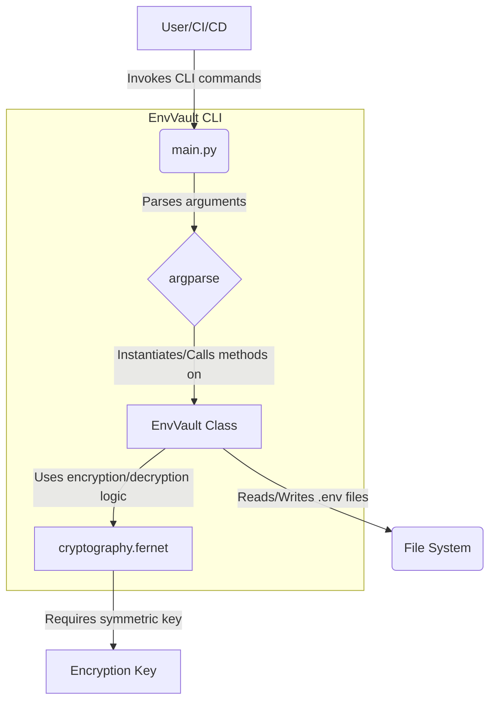

# EnvVault CLI: Architecture Overview

This document provides a deep dive into the architecture of the EnvVault CLI utility, outlining its design principles, technology choices, security model, and areas for future development.

## 1. Purpose and Problem Statement

In modern software development, applications often rely on sensitive configuration data, such as API keys, database credentials, and access tokens. Storing these secrets directly in plaintext `.env` files or committing them to version control poses significant security risks. EnvVault CLI addresses this by providing a simple, yet robust, command-line interface for symmetrically encrypting and decrypting these environment variables, allowing developers and CI/CD pipelines to manage sensitive data more securely.

## 2. Solution Overview

EnvVault CLI is a Python-based utility structured around a core `EnvVault` class that encapsulates the encryption/decryption logic. It interacts with the file system to read and write `.env`-style files and uses `argparse` for its command-line interface.

### High-Level Architecture:



## 3. Technology Stack

*   **Python**: The core language for the CLI utility, chosen for its readability, extensive library ecosystem, and cross-platform compatibility.
*   **`argparse`**: Python's standard library for parsing command-line arguments, providing a flexible and user-friendly CLI experience.
*   **`cryptography` library**: A powerful and well-audited cryptographic library for Python. EnvVault specifically uses its `Fernet` implementation.
    *   **Fernet**: A symmetric encryption scheme that provides authenticated encryption (confidentiality and authenticity). It uses AES in CBC mode with PKCS7 padding for encryption, and HMAC-SHA256 for authentication. It also includes a timestamp to prevent replay attacks and ensures that the key is a URL-safe base64 encoded string.

## 4. Key Management Strategy

The security of EnvVault relies entirely on the secrecy and proper management of the Fernet encryption key.

*   **Symmetric Key**: A single symmetric key is used for both encryption and decryption. This key is a 32-byte (256-bit) URL-safe base64 encoded string.
*   **Key Generation**: The `env-vault-cli generate-key` command provides a convenient way to generate a new, cryptographically strong Fernet key using `Fernet.generate_key()`.
*   **Key Provisioning**: The key **must not** be hardcoded or committed to version control. Users are responsible for securely storing and providing the key to the CLI utility. The primary methods supported are:
    *   **Environment Variable**: Setting the `ENVVAULT_KEY` environment variable (recommended for CI/CD and local development).
    *   **Command-Line Argument**: Passing the key directly via the `-k` or `--key` CLI option (less secure for interactive use due to command history).
*   **No Key Derivation (Current Version)**: For simplicity and to keep the initial scope focused, EnvVault CLI does not currently implement password-based key derivation (e.g., PBKDF2HMAC). The provided key is directly used as the Fernet key. This means the key itself must be a Fernet-compatible key.

## 5. File Formats

EnvVault CLI processes files that adhere to a simple `KEY=VALUE` format, typical of `.env` files.

*   **Plaintext Input (`.env`)**: Standard `.env` format. Lines starting with `#` are treated as comments and ignored during parsing. Empty lines are also ignored.
    ```env
    VAR1=value1
    # This is a comment
    VAR2=value2
    ```
*   **Encrypted Output (`.env.enc`)**: The output format is also `KEY=ENCRYPTED_VALUE`. Each `VALUE` is replaced by its Fernet-encrypted, URL-safe base64 encoded string representation.
    ```env
    VAR1=gAAAAABl... (long encrypted string)
    VAR2=gAAAAABl... (long encrypted string)
    ```

## 6. Security Considerations

*   **Key Compromise**: If the Fernet key is compromised, all data encrypted with that key can be decrypted. Robust key management practices are paramount.
*   **Side-Channel Attacks**: While the `cryptography` library is designed to be resistant to many side-channel attacks, the overall security depends on the execution environment. Avoid running the tool in untrusted environments where secrets might be leaked.
*   **Temporary Files**: When decrypting to a file, the plaintext is written to disk. Ensure that the file system is secure and that the temporary plaintext file is handled appropriately (e.g., promptly deleted if not needed).
*   **Command History**: Passing keys directly via command-line arguments can expose them in shell history files. Using environment variables mitigates this risk but doesn't eliminate visibility to other processes.

## 7. Future Enhancements

*   **Password-Based Key Derivation**: Implement PBKDF2HMAC or similar to derive the Fernet key from a user-provided password, enhancing usability by allowing users to remember a password instead of a long base64 key string.
*   **Configuration File Support**: Add support for a `envvault.json` or similar configuration file to define default input/output paths, key locations, or other settings.
*   **Integration with Cloud KMS**: Explore integrations with cloud Key Management Services (KMS) like AWS KMS, Google Cloud KMS, or Azure Key Vault for more centralized and managed key storage.
*   **Versioned Secrets**: Implement a mechanism to handle versioning of encrypted secrets, allowing rollbacks or auditing.
*   **Key Rotation**: Provide utilities or guidance for secure key rotation.
*   **Different Encryption Modes**: While Fernet is excellent, offering options for other robust encryption schemes could be considered for advanced use cases.
*   **Interactive Mode**: An interactive mode for encrypting/decrypting individual values or guiding users through file operations.
